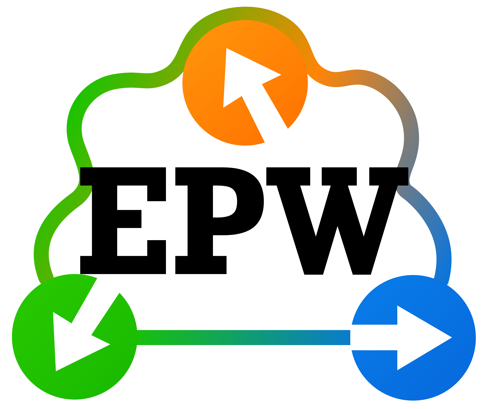
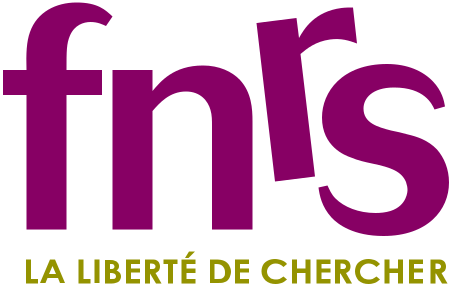

  

# `aiida-epw`

This is an [AiiDA](http://www.aiida.net/) plugin for [EPW](https://epw-code.org/).

## Installation
[//]: # (To install from PyPI, simply execute:)

[//]: # (    pip install aiida-epw )

To install from source, execute:

    git clone git@github.com:aiidaplugins/aiida-epw.git
    pip install aiida-epw

## Features

Currently, `aiida-epw` supports the following workflows:

- [`EpwPrepWorkChain`](src/aiida_epw/workflows/prep.py) contains the work chain used to perform EPW coarse grid Fourier transform to real-space
- [`EpwBaseWorkChain`](src/aiida_epw/workflows/base.py) contains base work chain to define momentum grids, validate inputs etc
- [`SuperConWorkChain`](src/aiida_epw/workflows/supercon.py) contains a work chain to compute superconductivity properties. See [M. Bercx et al., PRX Energy 4, 033012 (2025)](https://journals.aps.org/prxenergy/abstract/10.1103/sb28-fjc9) for more information.
- [`MobilityWorkChain`](src/aiida_epw/workflows/mobility.py) contains a work chain to compute carrier transport properties.

## Acknowledgements

This work was supported by the Belgian Fund for Scientific Research - [FNRS](https://www.frs-fnrs.be/en/) and the Swiss National Science Foundation ([SNSF](https://www.snf.ch/en)).

  
  

## License

MIT

## Contact

`aiida-epw` is developed and maintained by

* [Marnik Bercx](https://www.psi.ch/en/lms/people/marnik-bercx)
* [Samuel Poncé](https://www.samuelponce.com/) - samuel.ponce@uclouvain.be
* [Yiming Zhang](https://www.samuelponce.com/group#h.h4zp3wph86c2) - yiming.zhang@uclouvain.be
* [Binbin Liu](https://people.epfl.ch/binbin.liu) - binbin.liu@epfl.ch
